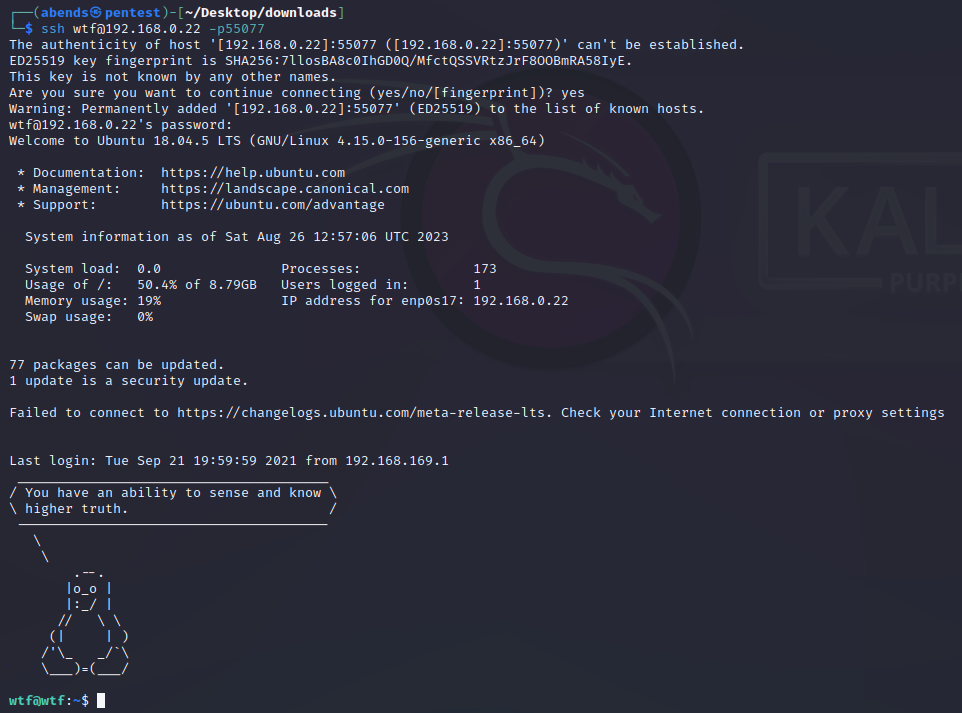

# VulnHub: Noob

Сканируем машину на наличие открытых портов при помощи Nmap:
```sh
nmap -sC -sV 192.168.0.22
```


Мы нашли:
- 21 port - FTP (vsftpd 3.0.3)
- 80 port - HTTP (Apache httpd 2.4.29)

При переходе на веб-ресурс попадаем на страницу логина:


Возвращаемся к FTP-серверу, куда входим под аккаунтом **anonymous**. Сразу копируем все файлы:
 


Файл **welcome**:


Файл **cred.txt**:


Декодируем содержимое файла из base64:


Получаем данные (**champ:password**) для входа на веб-ресурс:


При нажатии на **About Us** происходит скачивание архива **downloads.rar**:


В файле **sudo** намек на его же название. Скорее всего, информация скрыта внутри картинок, которые находятся внутри архива. Через **steghide** проверим это:


Примечательно, что данный пароль (**sudo**) применяется только к одному из файлов (с расширением **bmp**). Извлекаем данные:


В файле **hint.py** нам говорят, что мы ходим вокруг да около. Декодируем содержимое **user.txt** с помощью ROT-13


На всякий случай маломальски проверяем файл **hint.py**:


Декодированная фраза похожа на данные для входа (логин: wtf, пароль: this one is a simple one). Тут вспоминаем, что в самом начале мы не обнаружили порт для SSH. Исправляемся:


Порт нашли, пробуем подключиться:



У нас это успешно получается. Забираем первый флаг:


Проверяем, что мы можем исполнять от лица sudo:


В итоге мы имеем полный доступ к sudo, поэтому через, например, `sudo -i` получаем привилегированный доступ и забираем второй флаг.
